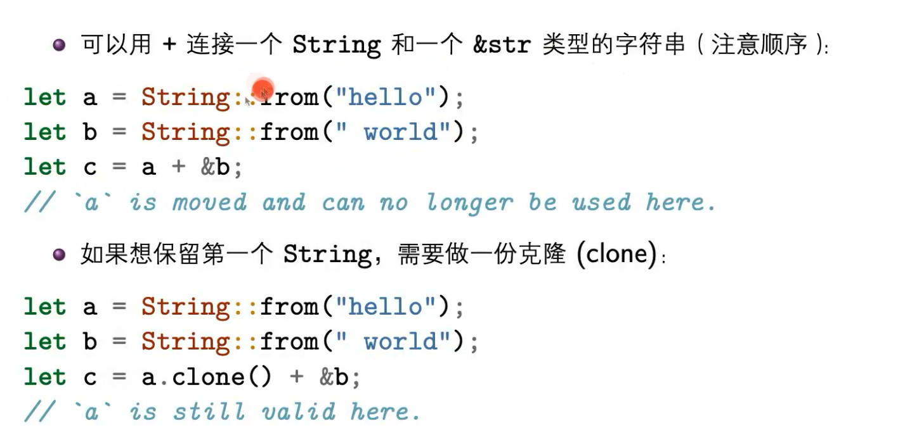

# 每日疑难

## 2023.04.02


### 在rust中，函数的返回值类型必须是明确的，而且所有返回值表达式的类型必须一致

#### 结构体定义和实例化，还有结构体更新

以下为错误代码

```rust
struct Vivo{
    domain:String::from("xiling.tech"),
    name:String::from("xiling"),
    nation:String::from("china"),
    traffic:100
}

fn main(){


    let domain = String::from("xiling.tech");
    let name = String::from("xiling");
    let runoob = Site{
        domain,
        name,
        nation:String::from("china"),
        traffic:100
    };
    let oppo = Vivo {
        domain: String::from("xiling.tech"),
        name: String::from("xiling"),
        ..runoob
    };
}
```

以下为修正后的代码

```rust
struct Vivo {
    domain: String,
    name: String,
    nation: String,
    traffic: i32,
}

fn main() {
    let domain = String::from("xiling.tech");
    let name = String::from("xiling");
    let runoob = Vivo {
        domain: domain.clone(),
        name: name.clone(),
        nation: String::from("china"),
        traffic: 100,
    };
    let oppo = Vivo {
        domain: String::from("xiling.tech"),
        name: String::from("xiling"),
        ..runoob
    };
}
```

这个代码中，我们定义了一个名为 `Vivo` 的结构体，并定义了四个属性：`domain`、`name`、`nation` 和 `traffic`。在 `main` 函数中，我们首先创建了两个 `String` 类型的变量 `domain` 和 `name`，然后使用这些变量创建了一个 `Vivo` 类型的变量 `runoob`。我们使用 `clone()` 方法来创建 `runoob` 中的 `domain` 和 `name` 字段，以便避免转移变量的所有权。最后，我们使用 `..runoob` 来使用 `runoob` 的剩余字段初始化 `oppo` 变量。

如果不使用 `clone()` 方法，那么在将 `domain` 和 `name` 字段的值从 `domain` 和 `name` 变量中移动到 `runoob` 变量中时，会发生所有权转移，这会导致 `domain` 和 `name` 变量的所有权被移动到了 `runoob` 中，从而无法再次使用这些变量。

**不使用clone()方法的解决办法:可以将domain和name的类型从String更改为\&str**


### **#\[derive(Debug)]**

`#[derive(Debug)]` 是 Rust 中的一个属性（attribute），它告诉编译器为结构体或枚举类型实现 Debug trait。

Debug trait 是 Rust 的一个特殊 trait，它用于打印调试信息。Rust 提供了 `println!("{:?}", some_variable)` 的语法来打印一个值的调试信息，其中 `{:?}` 是一个占位符，可以打印任何实现了 Debug trait 的类型。如果一个类型没有实现 Debug trait，那么编译器将无法打印它的调试信息。

`#[derive(Debug)]` 属性可以自动为**结构体**或**枚举类型**实现 Debug trait，使得它们可以通过 `println!("{:?}", some_variable)` 的方式打印调试信息。具体来说，它会生成一个默认的 Debug 实现，该实现将所有字段以及它们的值打印出来。

<figure><figcaption><p>picture1</p></figcaption></figure>

<figure><figcaption><p>picture2</p></figcaption></figure>

<figure><figcaption></figcaption></figure>

`?` 操作符需要一个变量来承载正确的值

同时我们又一次看到了`Box<dyn Error>` 特征对象，因为 `std::error:Error` 是 Rust 中抽象层次最高的错误，其它标准库中的错误都实现了该特征，因此我们可以用该特征对象代表一切错误，就算 `main` 函数中调用任何标准库函数发生错误，都可以通过 `Box<dyn Error>` 这个特征对象进行返回.

\
